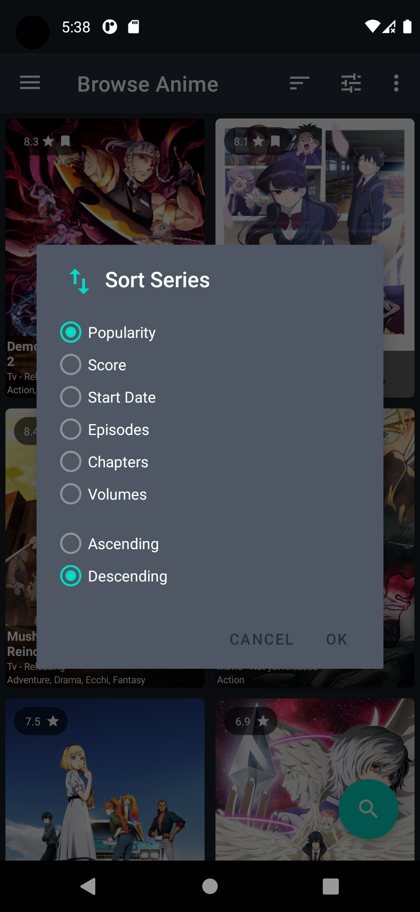

# Anima
This is an individual project for browsing and discovering new/old anime & manga. Also, users can add series to his planning list, currently watching, and many more lists and update his progress in each show. Users can
log in and be in sync with their account on [anilist.co](https://anilist.co/).
 
[Demo Link](https://youtu.be/uXPp6MSak0I)

## Tools Used
* ApolloClient (Graphql)
* Kotlin Coroutines
* Notification
* Room Database (cache)
* Navigation Component
* MVVM
* Paging 3
* Dagger Hilt (Dependency Injection)
* Data Binding
* View Binding
* Singleton Pattern
* Strategic Pattern
* Factory Pattern

  
  
   
   
  
  
  
  
   
   
   
   

#### References
* Api: https://github.com/AniList/ApiV2-GraphQL-Docs
* GraphQl: https://graphql.org/learn/
* ApolloClient: https://www.apollographql.com/docs/android/
* Similar app: https://github.com/AniTrend/anitrend-app